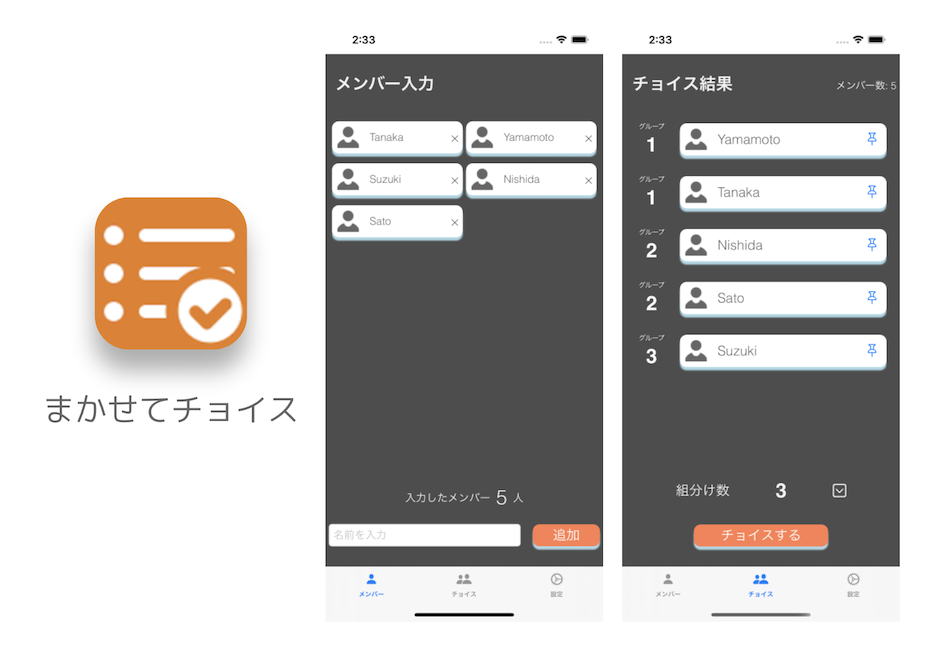
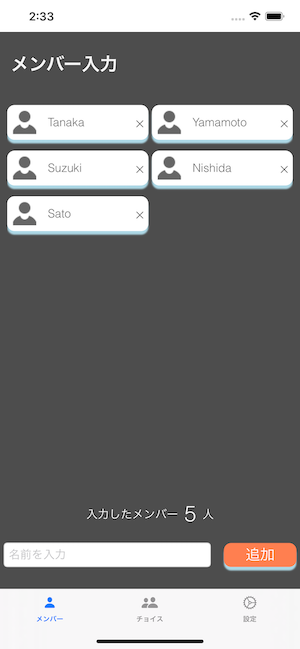
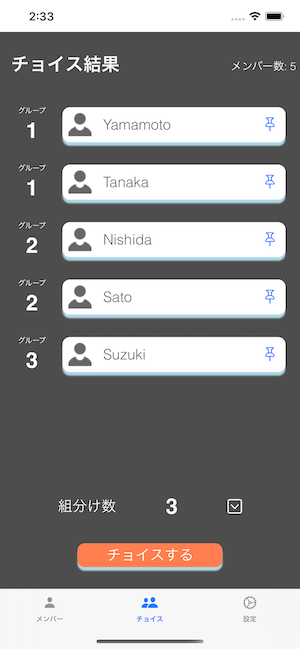

# まかせてチョイス

---

## このアプリについて

◆ ◆ ◆ このアプリの特徴 ◆ ◆ ◆

友達と遊んでいる時、グループワークを始めたい時、ゲームを始める時、授業で演習を始める時など、グループ分けが必要なシチュエーションが多くあります。

そんな時、ランダムでグループを振り分けてくれるのが「まかせてチョイス」です。

メンバーとグループ数を入力するだけで簡単にグループ分けをすることが出来ます。

## スクリーンショット

## アーキテクチャ

アプリ全体のアーキテクチャは、SwiftUIのアプリを設計するに当たって有力とされている[ELMアーキテクチャ](https://guide.elm-lang.org/architecture/)をベースに、下の図のような設計で実装を行なっています。

画像参照元：https://nalexn.github.io/clean-architecture-swiftui/

参考記事：https://nalexn.github.io/clean-architecture-swiftui/

## Credentials

All of icons in this app from [Icon8](https://icons8.com/)

